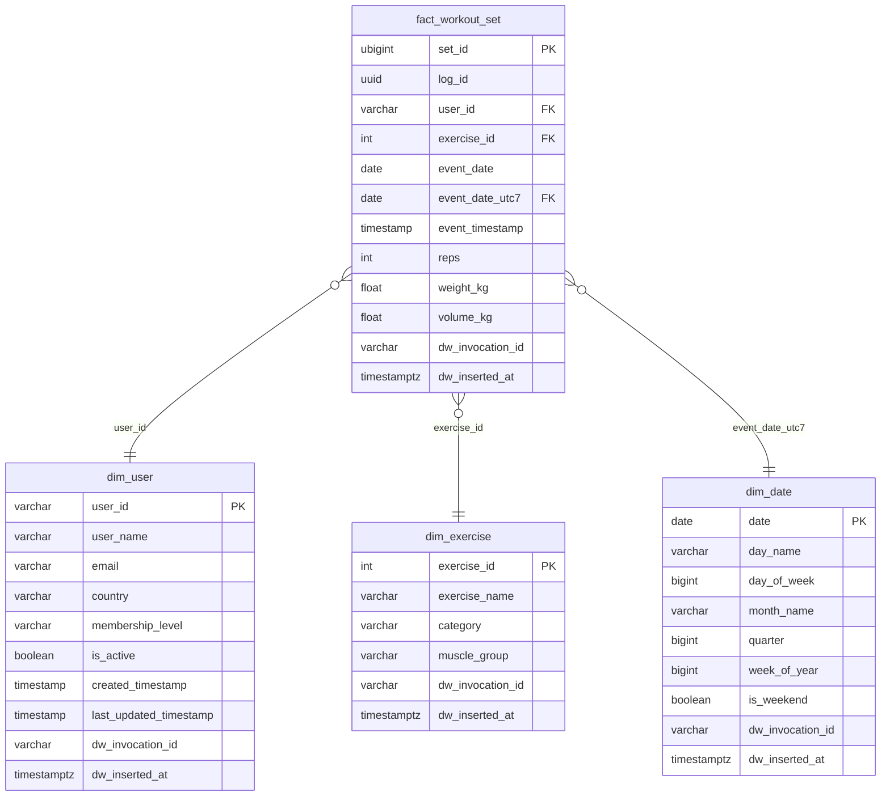
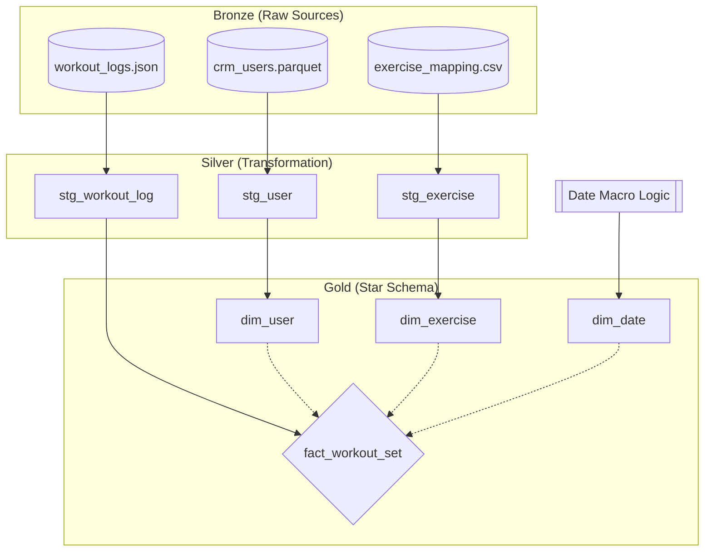

# Exploring Local-first Data Stack: dbt & DuckDB

## 1. Technical Context: dbt + DuckDB

I built this project to see how far I could push a local-first data stack. By using DuckDB as the engine, I wanted to see if we could skip the high costs and slow 'waiting-for-cloud' latency of traditional warehouses, especially for development or smaller datasets.

### Pros vs. Cloud Warehouses (BigQuery / Databricks)

| Feature | dbt + DuckDB | dbt + BigQuery / Databricks |
| --- | --- | --- |
| **Cost** | **Zero.** Runs on local CPU/RAM. | **Variable.** Costs for compute and storage. |
| **Latency** | **Near-Zero.** No network round-trips to the cloud. | **High.** Slower for small-scale transformations. |
| **Setup** | **Simple.** Single file database, no IAM/Security setup. | **Complex.** Requires cloud project, service accounts, and VPCs. |
| **Portability** | **High.** The entire DWH is a single `.duckdb` file. | **Low.** Locked into a specific cloud ecosystem. |

### Cons

* **Concurrency:** DuckDB is optimized for single-user/single-process write access.
* **Vertical Scaling:** Limited by the hardware of the host machine (though it can handle 100M+ rows easily).

## 2. Project Purpose

### Project Purpose

I put this project together to get hands-on with a few specific concepts:

* **Practicing Medallion Architecture:** I wanted to see how it felt to move data through Bronze (raw), Silver (cleaned), and Gold (final) layers to keep things organized.
* **Testing File Interoperability:** I was curious about how easily I could join different formats like Parquet, JSON, and CSV in a single query without a lot of extra setup.
* **Learning dbt Macros:** I built some macros to handle table aliases and schemas automatically, so I could switch between `dev` and `prod` environments without manual work.
* **Checking Performance:** I wanted to experience DuckDB’s speed firsthand, specifically how its columnar storage makes analytical queries feel almost instant.
* **Exploring Marimo for Analysis**: I wanted to move away from Jupyter and try Marimo. People claim it’s faster and more reliable, but I was mainly interested in its native SQL blocks. It lets me write pure SQL to explore my Gold tables without needing a bunch of Python boilerplate.

> **A quick heads-up on the "Deal Breaker":**
> Because DuckDB is an in-process database, it locks the file when a process is writing to it. Even as a solo developer, I found myself constantly "toggling" connections, that is I need to close my Marimo notebook or IDE connection just so `dbt` could run. In a team environment with multiple developers, you'd likely need to move to a MotherDuck setup or a central Postgres/S3 backend to avoid driving each other crazy with file locks.

## 3. Structure

### ERD for Gold Layer (Star Schema)


### Data Lineage (Mendalion Architecture)



## Installation & Setup

### 1. Virtual Environment

First, create a clean environment and activate it.

```bash
# Create environment
python3 -m venv .venv

# Activate environment (Mac/Linux)
source .venv/bin/activate

# For Windows:
# .venv\Scripts\activate

```

### 2. Core Dependencies

Install `dbt-duckdb` and `polars` (used in your generator script). `dbt-duckdb` will automatically install `dbt-core` and the `duckdb` engine.

```bash
# Upgrade pip and install packages
pip install --upgrade pip
pip install dbt-duckdb polars faker marimo[sql]
```

### 3. Database Exploration (Optional Test)

Check if DuckDB is working correctly by running a quick inline script:

```bash
python3 -c "import duckdb; con = duckdb.connect('.storage/exploration.db'); con.sql('SELECT 1 AS status').show()"

```

### 4. Data Generation

Run your Polars-based script to generate the raw source files (JSON, Parquet, CSV) into your `.storage/sources/` directory.

```bash
python3 generate_data.py

```


## Dbt Workflow

### 5. Setup Environment & Profiles

We use a local `profiles.yml` that references environment variables. You must export your `.env` variables so dbt can read them.

1. **Configure Environment:**
Copy `.env.example` to `.env` and fill in your `DBT_USER`.
2. **Export Variables:**
```bash
export $(cat .env | xargs)

```


3. **Validate Connection:**
Ensure dbt can find the project and the DuckDB file.
```bash
dbt debug

```


### 6. Run the Pipeline

Run the layers in sequence. We use the `--full-refresh` (`-f`) flag to ensure all table structures are recreated according to your latest changes.

```bash
# Process Silver (Staging) then Gold (Marts)
dbt run -s silver -f && dbt run -s gold -f

```


## Exploration (Marimo)

### 7. Launch Marimo

Marimo is used for data exploration and ad-hoc analysis of Gold layer.

```bash
# Launch the marimo editor
marimo edit exploration.py

```

```python
import marimo as mo
import duckdb

# Define the path to your target warehouse
DEV_URL = ".storage/dev/dev_warehouse.duckdb"
PROD_URL = ".storage/prod/prod_warehouse.duckdb"

# Initialize the connection
engine = duckdb.connect(PROD_URL)

```

**Releasing the Database Lock:**
DuckDB only allows one process to have "write" access at a time. If you need to run `dbt run` while Marimo is open, you must close the engine connection in Marimo first.

```python
# Run this cell to release the file lock for dbt
engine.close()
del engine

```


>TODO:
>- Create makefile
>- Add screenshot of marimo as SQL Platform
>- Add a little analysis using marimo